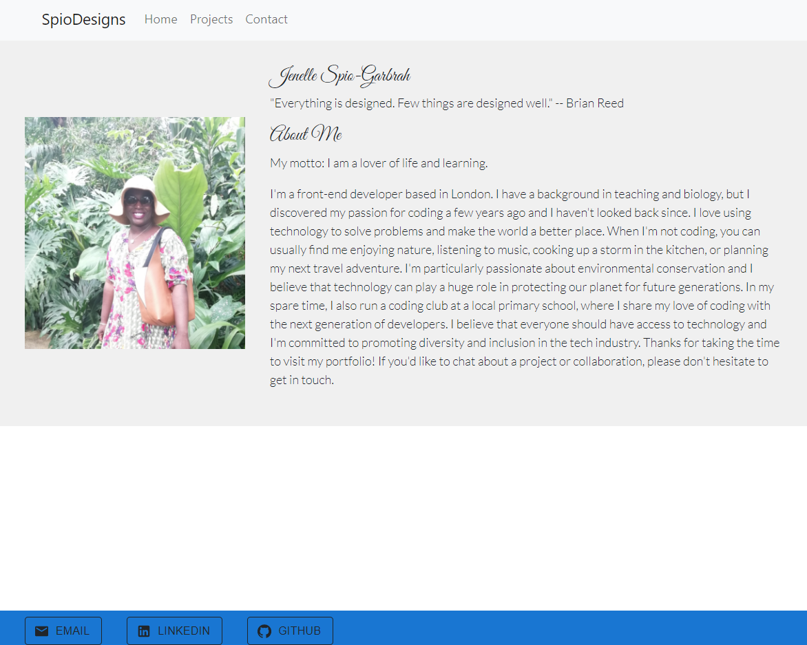

# React-Portfolio

## Description

This project is a personal profile website that showcases my skills, experiences, and projects. The website is built using Create  React App and styled with CSS. It includes multiple pages with a responsive design that adapts to different screen sizes. Visitors can browse my portfolio of projects, read about my professional background and skills, and contact me through a form.

The website features an intuitive navigation menu and a clean and modern design that highlights my personal brand. It is optimized for search engines and includes meta tags and descriptions to improve its discoverability. The project is open-source and available on GitHub, where others can contribute to it or reuse parts of the code for their own projects.

## Technologies Used
Create React App
CSS
HTML
JavaScript
Material UI
Bootstrap

## Installation
1. Clone the repository to your local machine
2. Install the required dependencies using npm
3. Run the project locally using npm start

## Usage

1. Open the browser and navigate to the project URL
2. Browse the pages and content using the navigation menu
3. Click on project images or links to learn more about each project
4. Fill out the contact form to get in touch with me

## Future Development
1. Adding more projects to the portfolio section
2. Improving the accessibility and user experience of the website
3. Integrating with third-party services such as LinkedIn or GitHub
4. Adding more personalization features, such as a dark mode or language selection

## License
  This project is licensed under the MIT license.

## Screenshot

